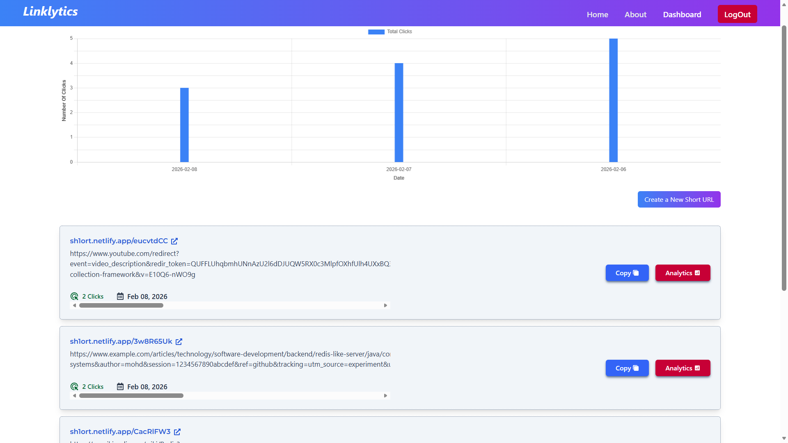

<h1 align="center" style="margin: 20px 0px; font-size: 3rem; font-weight: bold;">
  URL Shortener
</h1>

[](https://sh1ort.netlify.app/)

> **Transform your long, messy URLs into sleek, trackable, and powerful short links.**

> A modern, responsive, and feature-rich URL shortener application built with React and Vite. Experience the power of analytics and easy link management.


Check out the live application here: [**https://sh1ort.netlify.app/**](https://sh1ort.netlify.app/)


## 🚀 Features

The application comes packed with features to manage your links effectively:

- 🔐 **User Authentication**: Secure Login and Registration pages with JWT.
- 📊 **Interactive Dashboard**: A centralized hub to manage all your shortened links.
- ✂️ **Instant Shortening**: Convert long URLs into shareable short links in seconds.
- 📈 **Detailed Analytics**: Track click counts and engagement over time with beautiful charts.
- 📋 **Copy to Clipboard**: One-click copying for generated short URLs.
- 📱 **Fully Responsive**: Optimized for desktop, tablet, and mobile devices.
- 🔔 **Real-time Feedback**: Toast notifications for success and error messages.
- 🌓 **Modern UI**: Clean design using Tailwind CSS and Material UI components.

---
## Dashboard


## 🛠️ Tech Stack

This project is built using a robust and modern technology stack:

### Frontend


### State & API


### Libraries & Tools


## 📂 Project Structure

Here is a quick overview of the project structure:

```
url-shortener-frontend/
├── public/              # Static assets
├── src/
│   ├── api/             # API configuration (Axios instance)
│   ├── assets/          # Project assets (images, fonts, svg)
│   ├── components/      # Reusable UI components
│   │   ├── dashboard/   # Dashboard specific components
│   │   ├── LandingPage.jsx
│   │   ├── Navbar.jsx
│   │   └── ...
│   ├── contextApi/      # Global state management
│   ├── hooks/           # Custom React hooks
│   ├── App.jsx          # Main application component & Routing
│   └── main.jsx         # Entry point
├── .env                 # Environment variables
├── package.json         # Project dependencies and scripts
└── readme.md            # Project documentation
```

---

## 🤝 Contributing

Contributions are always welcome! If you have any suggestions or want to improve the codebase, please follow these steps:

1.  **Fork** the repository.
2.  Create a new branch (`git checkout -b feature/YourFeature`).
3.  **Commit** your changes (`git commit -m 'Add some feature'`).
4.  **Push** to the branch (`git push origin feature/YourFeature`).
5.  Open a **Pull Request**.

---

## 📝 License

This project is open-source and available under the information in the LICENSE file.

---

<p align="center">
  Made with ❤️ by <a href="https://github.com/mdfaizan-21">Faizan</a>
</p>
